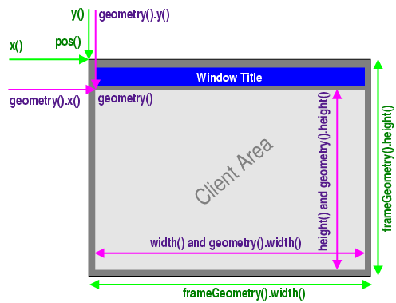

# Notes for PySide6

## [Window and Dialog Widgets](https://doc.qt.io/qtforpython/overviews/application-windows.html)

A widget that is not embedded in a parent widget is called a window. In Qt, **QMainWindow** and the various subclasses of **QDialog** are the most common window types.

### Primary and Secondary Windows

Any **QWidget** that has no parent will become a window, and will on most platforms be listed in the desktop's task bar.
In addition, a **QWidget** that has a parent can become a window by setting the **Window** flag.
The **QMainWindow** class sets the **Window** flag in its constructor, as it is designed to be used as a window and provides facilities that are not wanted for child widgets.

### Main Windows and Dialogs

The **Application Main Window** provides the framework for building the application's main user interface, and are created by subclassing QMainWindow. QMainWindow has its own layout to which you can add a 
- menu bar,
- tool bars, 
- dockable widgets, and 
- status bar.
The center area can be occupied by any kind of QWidget.

**Dialog Windows** are used as secondary windows that present the user with options and choices. Dialogs are created by subclassing QDialog and using **widgets and layouts** to implement the user interface. In addition, Qt provides a number of ready-made standard dialongs that can be used for standard tasks like file or font selection.

### Window Geometry

**QWidget** provides several functions that deal with a widget's geometry. Some of these functions operate on the pure chient area(i.e. the window excluding the window frame), other include the window frame.

> Including the window frame: x(), y(), frameGeometry(), pos(), and move()
> Excluding the window frame: geometry(), width(), height(), rect(), and size()

Note that the distinction only matters for decorated top-level widgets. For all child widgets, the frame geometry is equal to the widget’s client geometry.

This diagram shows most of the functions in use:

## [Coordinate System](https://doc.qt.io/qtforpython/overviews/coordsys.html)

The coordinate system is controlled by the **QPainter** class. Together with the **QPaintDevice** and **QPaintEngine** classes, **QPainter** form the basis of Qt's painting system, Arthur.

**QPainter** is used to perform drawing operations.
**QPaintDevice** is an abstraction of a two-dimensional space that can be painted on using a QPainter.
**QPaintEngine** provides the interface that the painter uses to draw onto different types fo devices.

